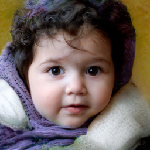
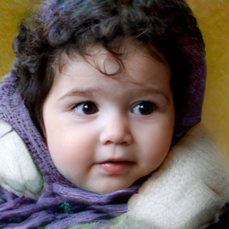
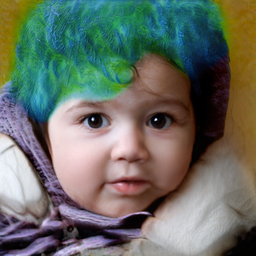
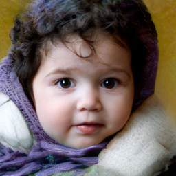
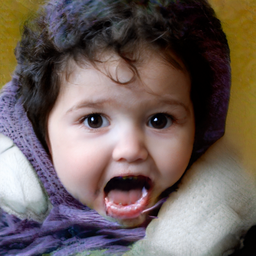

# Simple StyleSpace Run

| default | eye | hair | lip | mouth |
|:---:|:---:|:---:|:---:|:---:|
|   |  |  |  |  |

### Run StyleSpace
1. locate `stylegan2-ffhq-config-f.pt` under the folder `checkpoint`
2. run `python stylespace.py`

## Credits

StyleGAN2 model and implementation:  
https://github.com/rosinality/stylegan2-pytorch  
Copyright (c) 2019 Kim Seonghyeon  
License (MIT) https://github.com/rosinality/stylegan2-pytorch/blob/master/LICENSE  

StyleSpace pytorch implementation  
https://github.com/xrenaa/StyleSpace-pytorch
